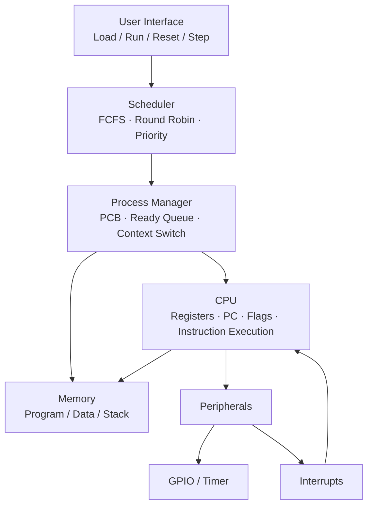
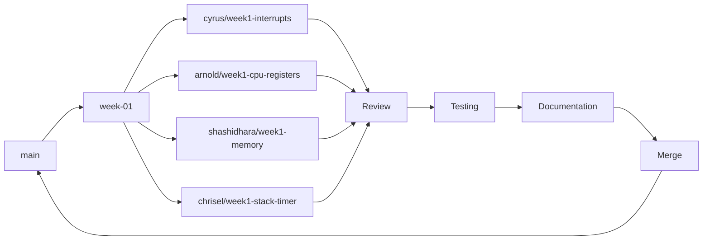

# STC89C52 Microcontroller Simulator

## Problem Objective
Develop a STC89C52 microcontroller simulator for instruction execution memory and peripheral operations and process management.This will help the student visualize the program and understand helping users visualize how programs execute and how CPU scheduling manages multiple programs.

## Problem Statement
Design and implement a software based simulator for the assigned 8-bit microcontroller, the STC89C52.The simulator will simulate the essential processor components and executes the instructions, manage program memory, data memory and stack, and provide simplified GPIO, timer, and interrupt functionality. It will also support multiple programs as processes using a Process Control Block (PCB), a ready queue, context switching, and the FCFS, Round Robin, and Priority CPU scheduling algorithms.

## Project Scope
- Simulate core CPU behavior of the STC89C52.
- Execute a defined subset of 8051 instructions with correct state updates.
- Simulate memory (program/data/stack), GPIO, timers, and interrupts.
- Represent multiple loaded programs as OS-style processes with PCBs and state transitions.
- Implement data structures: stack, queue, circular queue, instruction lookup table.
- Implement FCFS, Round Robin, and Priority scheduling with context switching.
- Provide an interactive UI: load, run, reset, single-step.
- Report performance metrics: waiting time, turnaround time, response time, context switches, CPU utilization.
- **Out of scope:** full/complete 8051 instruction set and cycle-accurate hardware emulation — only the subset needed to demonstrate the above.

## Microcontroller Being Simulated
**STC89C52** an enhanced 8051 family 8-bit microcontroller (4 KB+ internal RAM variant, standard 8051 register/instruction architecture, 4 GPIO ports, 3 timers/counters, standard 8051 interrupt structure).

## Team
**Team Name:** Bondaas

| Role | Name | Roll No | Contact |
|---|---|---|---|
| Team Leader | Cyrus Shobith Pinto | 25190111 | — |
| Member | Arnold Noah | 25190106 | 8951619591 |
| Member | Shashidhara | 25190148 | 7411004525 |
| Member | Chrisel Lobo | 25190110 | — |

## Team Responsibilities

| Member | Primary Responsibility | Supporting Responsibility |
|---|---|---|
| Cyrus (Team Leader) | CPU & Instruction Execution — **Interrupt mechanism**; overall integration | GitHub repo administration, coordination, task balancing |
| Arnold Noah | Memory & Stack topics — **CPU/register organization, Status/flag info, Instruction categories, GPIO** | CPU support |
| Shashidhara | Data Structures & Process Management — **Memory organization, Program Counter** | Testing |
| Chrisel Lobo | OS Scheduling & Context Switching — **Timer, Stack mechanism / Stack pointer** | UI & Integration |


## Selected Programming Language
**Java**

- **Reason for selection:** Assigned as the preferred language for this project; strong OOP support suits modeling CPU/registers/memory/processes as classes; team has prior Java familiarity from coursework.
- **Advantages for this project:** Clear class-based modeling of PCB, registers, and memory; built-in collections (`Queue`, `Deque`, `PriorityQueue`) map directly onto FCFS/Round Robin/Priority scheduling; strong tooling for a Swing/JavaFX or web-based (Spring) visualization layer.
- **Limitations:** More verbose than scripting languages for quick prototyping; no low-level bit/memory-mapped register access as direct as C, so register/flag simulation is done via wrapper classes instead of raw memory.
- **Alternative languages considered:** None finalized — Java is being used as assigned. If the team later needs a different language for a specific module (e.g. Python for quick data analysis of performance metrics), that will be documented separately with faculty approval, per project rules.

## Initial System Architecture




## Initial Development Plan

| Week | Focus |
|---|---|
| 1 | Team formation, repo setup, STC89C52 architecture study, language finalization, initial design |
| 2 | CPU model: registers, PC, flags, memory representation; start instruction execution |
| 3 | Stack, GPIO, timer, interrupt simulation |
| 4 | Process/PCB model, ready queue, context switching |
| 5 | Scheduling algorithms: FCFS, Round Robin, Priority |
| 6 | UI: load/run/reset/step, integration |
| 7 | Performance metrics (waiting/turnaround/response time, CPU utilization) |
| 8 | Testing, documentation, final polish |


## Git Workflow

- Every Monday: pull latest `main`, merge into the weekly branch, open PRs from individual branches into `week-01`.
- After review + testing + documentation, `week-01` is merged into `main`.



## Communication Rules
- **GitHub Issues** — technical questions, bugs, design concerns, tasks, decisions requiring discussion.
- **Google Classroom / shared Google Docs (college email only)** — meeting minutes, weekly status reports, formal documentation.
- **Miro** — shared board for planning and task breakdown.
- **Google Chat (college email only)** — day-to-day coordination among members.
- **Google Meet (with transcription)** — meetings are recorded and transcribed to support accurate minutes.

## Repository Structure
```
project-root/
├── README.md
├── .gitignore
├── docs/
│   ├── meetings/
│   ├── decisions/
│   └── weekly-status/
├── src/
├── tests/
└── programs/
```
