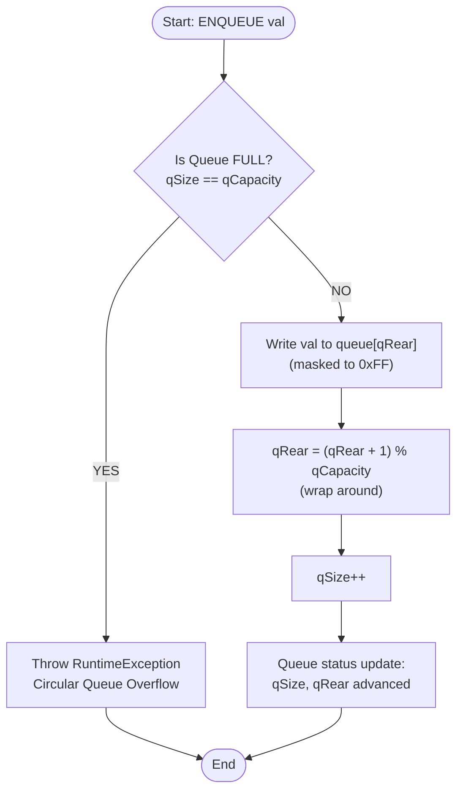
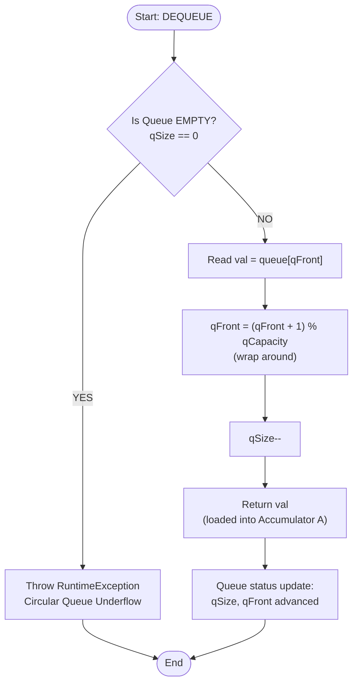
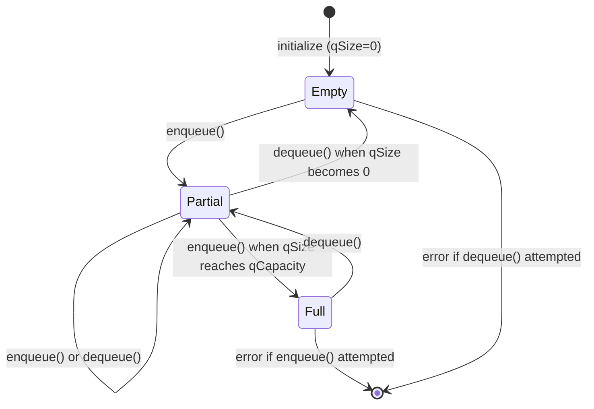

# Queue Flowchart — Week 3 Deliverable

## STC89C52 Simulator — Circular FIFO Queue

This document contains the flowchart for the FIFO Queue implemented in `DataStructures.java`.

---

## ENQUEUE Operation



---

## DEQUEUE Operation



---

## Queue Status / State Diagram



---

## Queue Parameters

| Parameter | Value | Meaning |
|-----------|-------|---------|
| `qCapacity` | 16 | Maximum items the queue can hold |
| `qFront` | 0 (init) | Index of next item to dequeue |
| `qRear` | 0 (init) | Index where next item will be enqueued |
| `qSize` | 0 (init) | Current number of items in queue |
| Overflow guard | `qSize == qCapacity` | Throws exception |
| Underflow guard | `qSize == 0` | Throws exception |

---

## Assembly Example (FIFO validation)

See `programs/QueueTest.java` for the full runnable validation.

```
; Enqueue 3 values
MOV  A, #10    ; A = 10
ENQUEUE A      ; Q = [10]
MOV  A, #30    ; A = 30
ENQUEUE A      ; Q = [10, 30]
MOV  A, #5     ; A = 5
ENQUEUE A      ; Q = [10, 30, 5]

; Dequeue in FIFO order
DEQUEUE A      ; A = 10  ← first in, first out ✓
DEQUEUE A      ; A = 30                          ✓
DEQUEUE A      ; A = 5                           ✓
HALT
```
